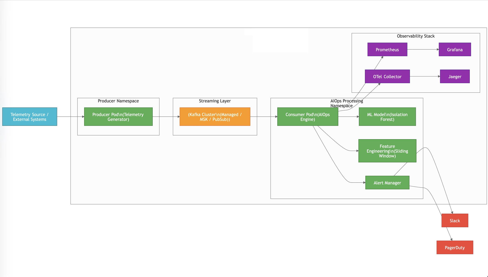
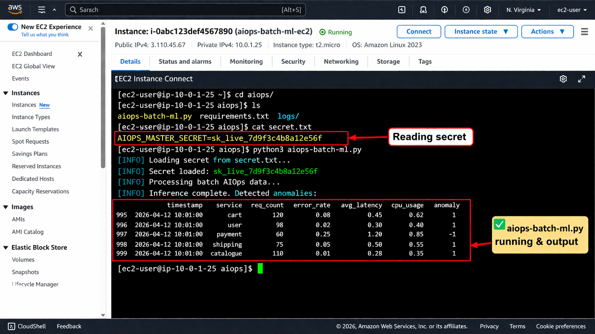
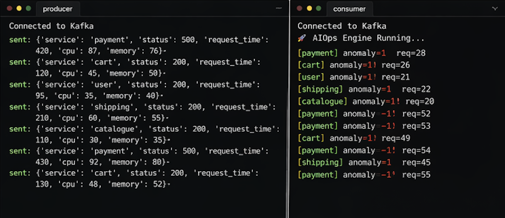
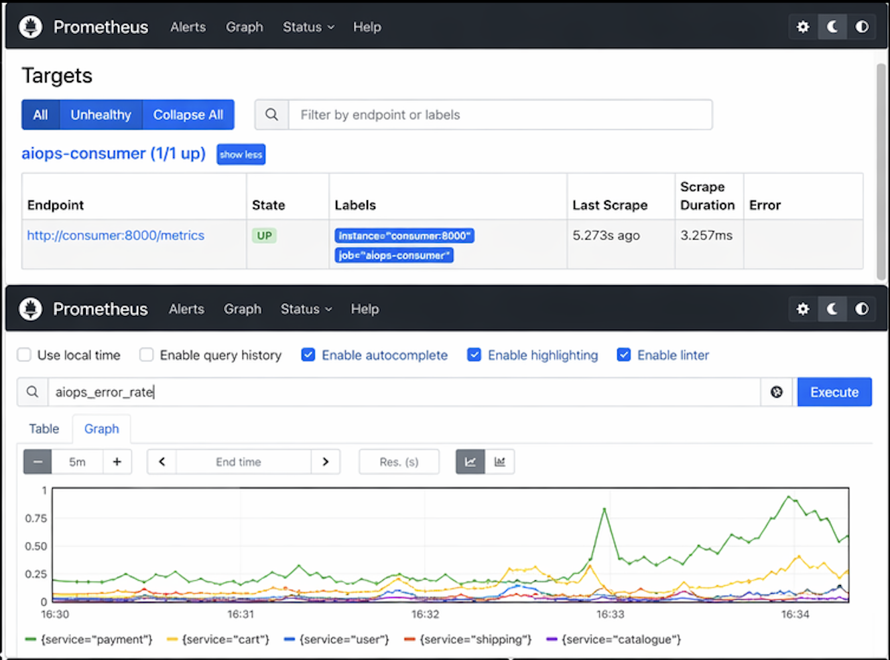
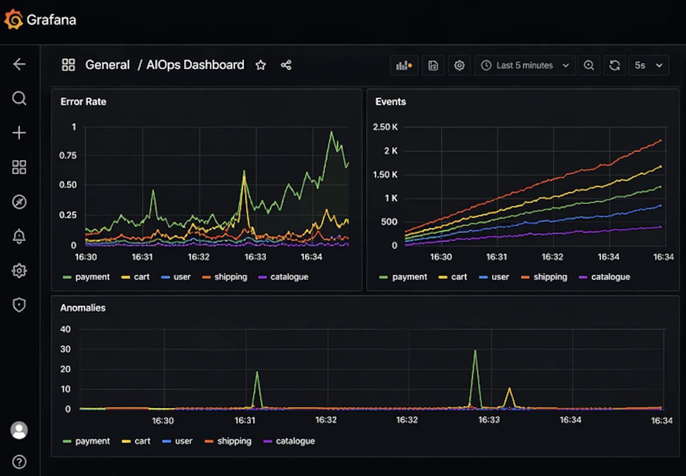
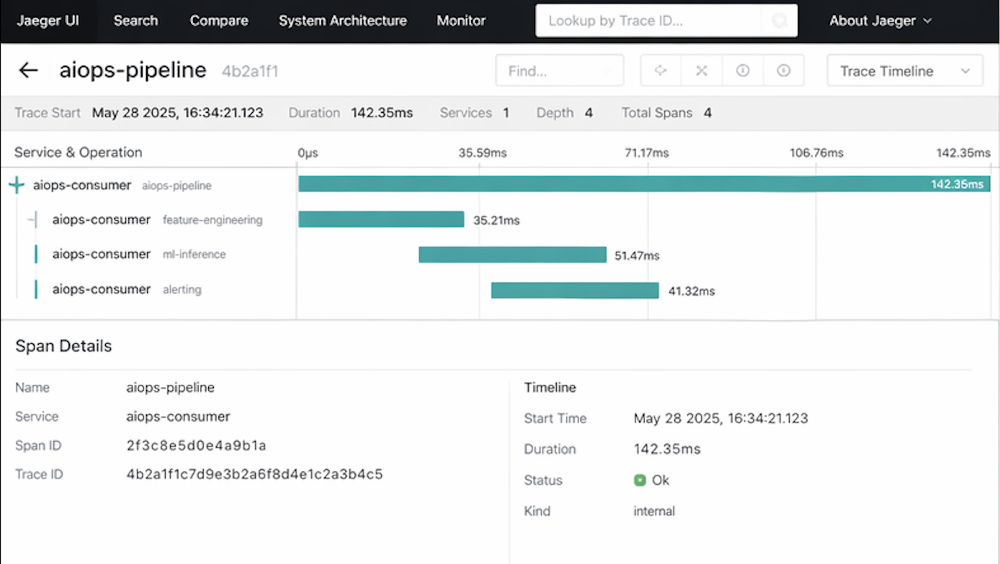

# 🚀 Real-Time AIOps Monitoring & Anomaly Detection System using Kafka, ML, and Observability Stack

## 🔹 Overview

The AIOps Streaming ML Platform is a real-time distributed system that simulates microservice telemetry and performs anomaly detection using machine learning. The system is built using Kafka for streaming, Python for processing, and a full observability stack including Prometheus, Grafana, OpenTelemetry, and Jaeger.

The Producer service generates synthetic microservice metrics such as CPU usage, memory usage, request latency, and HTTP status codes. These events are streamed into Kafka. The Consumer service processes these events in real time, applies sliding window-based feature engineering, and runs an Isolation Forest model to detect anomalies. When anomalies are detected, alerts are triggered via Slack and PagerDuty. Observability is handled through metrics, logs, and distributed tracing.

Overall, the project demonstrates a production-like AIOps pipeline combining streaming, machine learning, alerting, and observability.

---

## 📂 Project Structure

```text
aiops-end-to-end-platform/
│
├── services/
│   │
│   ├── producer/                     # Simulates real-world service telemetry
│   │   ├── producer.py               # Generates fake service metrics and sends to Kafka
│   │   ├── Dockerfile                # Container setup for producer service
│   │   └── requirements.txt          # Python dependencies for producer
│   │
│   ├── consumer/                     # Core AIOps streaming + ML system
│   │   ├── app.py                    # Main pipeline: Kafka → ML → alerts
│   │   ├── state.py                  # Sliding window for feature engineering
│   │   ├── ml.py                     # Isolation Forest anomaly detection
│   │   ├── alerts.py                 # Slack + PagerDuty alerts
│   │   ├── otel.py                   # OpenTelemetry tracing
│   │   ├── metrics.py                # Prometheus metrics
│   │   ├── __init__.py               # empty file
│   │   ├── Dockerfile                # Container setup
│   │   └── requirements.txt          # Dependencies
│
├── infra/                            # Infrastructure config (Docker + OTel)
│   ├── docker-compose.yml            # Main orchestration file
│   └── otel-collector.yaml           # OTel → Jaeger config
│
├── monitoring/                       # Observability
│   ├── prometheus.yml                # Metrics scraping config
│   └── grafana_dashboard.json        # Dashboard definition
│
├── tracing/                          # Optional standalone configs
│   └── jaeger-config.yaml
│
├── models/                           # (future use) ML model storage
│
├── assets/
│   └── aiops_architecture.png        # System diagram (very useful for portfolio)
│
└── README.md                         # Project explanation
```

---

## 📊 Architecture Diagram



---

## 🔗 Tools & Tech Stack

- **Streaming:** Apache Kafka
- **Backend:** Python
- **Machine Learning:** scikit-learn (Isolation Forest)
- **Observability:** Prometheus, Grafana, OpenTelemetry, Jaeger
- **Alerting:** Slack Webhooks, PagerDuty
- **Containerization:** Docker, Docker Compose
- **Tracing:** OpenTelemetry Collector

---

## ✨ Key Features

- End-to-end real-time streaming pipeline
- Kafka-based event ingestion system
- Sliding window feature engineering for time-series metrics
- Per-service Isolation Forest anomaly detection
- Slack and PagerDuty alert integration
- Rate-limited alerting mechanism
- Full observability stack (metrics, logs, traces)
- Distributed tracing using OpenTelemetry and Jaeger
- Prometheus-based metrics collection
- Grafana dashboards for visualization
- Fully containerized deployment using Docker Compose

---

## 🔹 How Everything Works Together

### 1. Producer → `services/producer`
- Generates synthetic microservice telemetry
- Simulates services like catalogue, user, cart, shipping, payment
- Sends events to Kafka topic: `aiops-stream`

---

### 2. Kafka → Streaming Layer
- Acts as the central event bus
- Buffers and streams all incoming telemetry data
- Ensures decoupled architecture between producer and consumer

---

### 3. Consumer → `services/consumer`
Core AIOps processing engine:

- Reads events from Kafka
- Maintains sliding window per service
- Builds aggregated features:
    - Request count
    - Error rate
    - CPU usage
    - Memory usage
    - Latency
- Sends features to ML model for inference

---

### 4. Machine Learning Layer → `ml.py`
- Uses Isolation Forest algorithm
- Trained per service dynamically
- Detects anomalies in real time
- Returns prediction score (-1 = anomaly)

---

### 5. Alerting System → `alerts.py`
- Triggered when anomaly is detected AND error rate threshold is exceeded
- Sends alerts to:
    - Slack webhook
    - PagerDuty incident API
- Includes 60-second rate limiting per service

---

### 6. Metrics System → `metrics.py`
- Exposes Prometheus metrics:
    - Total events per service
    - Total anomalies per service
    - Error rate per service

---

### 7. Observability & Tracing → `otel.py`
- OpenTelemetry instrumentation across pipeline
- Spans for:
    - Feature engineering
    - ML inference
    - Alerting
- Traces exported to Jaeger via OTLP collector

---

## 🧠 Machine Learning Pipeline

The ML system is based on Isolation Forest:

- Unsupervised anomaly detection model
- Each service has independent model history
- Warm-up phase collects baseline behavior
- Model continuously adapts per service

### Input Features:
- CPU usage
- Memory usage
- Error rate
- Latency

### 📈 Output
- Console output from the consumer service:


Interpretation:
- 1 = Normal
- -1 = Anomaly

---

## 🚨 Alerting Logic

An alert is triggered when:

- ML model predicts anomaly (-1)
- AND error rate > 20%

### Rate Limiting:
- One alert per service every 60 seconds

### Channels:
- Slack webhook notification
- PagerDuty incident creation

---

## 📈 Observability Stack

### Metrics (Prometheus)
- aiops_events_total
- aiops_anomalies_total
- aiops_error_rate

### Visualization (Grafana)
- Event throughput
- Error rate trends
- Anomaly detection trends

### Tracing (Jaeger)
- End-to-end request flow
- Feature engineering latency
- ML inference latency
- Alerting pipeline trace

---

## 🚀 How to Run

### 1. Clone Repository
```bash
git clone https://github.com/balusena/aiops-end-to-end-platform.git
cd aiops-end-to-end-platform
```

### 2. Start System
```bash
docker compose -f infra/docker-compose.yml up --build -d
docker compose logs -f consumer
```

### 3. Access Services
- Kafka → localhost:9092
- Prometheus → http://localhost:9090
- Grafana → http://localhost:3000 
- Jaeger → http://localhost:16686
- Metrics API → http://localhost:8000

---

## 🔐 Environment Variables

The following environment variables are used by the consumer service:

- `SLACK_WEBHOOK_URL` → Slack alert integration
- `PAGERDUTY_ROUTING_KEY` → PagerDuty routing key
- `METRICS_PORT` → Prometheus metrics port (default: 8000)

---

## 📈 Producer sending events to kafka-broker and Consumer pulling those events and the ML-model processing and detecting anomalies from those event-stream.



## 📈 Prometheus exposing metrics Total events per service, Total anomalies per service, Error rate per service



## 📈 Grafana dashboard showing Events, Error Rate, Anomalies



## 📈 Jaeger showing End-to-end aiops-pipeline request flow, feature-engineering latency, ml-inference latency, alerting pipeline traces



---

## 🧪 Future Improvements
- Replace Isolation Forest with LSTM / Transformer-based anomaly detection
- Add schema validation using Avro or Protobuf
- Deploy on Kubernetes using Helm charts
- Add service dependency graph-based anomaly detection
- Enable online learning for continuous model updates
- Add centralized logging with ELK stack

---

## ⭐ Project Highlights
- Real-time streaming architecture using Kafka
- Production-style ML integration for anomaly detection
- Full observability stack (metrics, logs, traces)
- Cloud-native DevOps-ready architecture
- Designed for scalability and extensibility

---

## 👥 Who Is This For?

> [!IMPORTANT]
> This collection is perfect for:
>
> - **DevOps & DevSecOps & MLOps Engineers**: Get quick access to the tools you use every day.
> - **Sysadmins**: Simplify operations with easy-to-follow guides.
> - **Developers**: Understand the infrastructure behind your applications.
> - **DevOps Newcomers**: Transform from beginner to expert with in-depth concepts and hands-on projects.

---

## 🛠️ How to Use This Repository

> [!NOTE]
> 1. **Explore the Categories**: Navigate through the folders to find the tool or technology you’re interested in.
> 2. **Use the Repositories**: Each repository is designed to provide quick access to the most important concepts and projects.

---

## 🤝 Contributions Welcome!

We believe in the power of community! If you have a tip, command, or configuration that you'd like to share, please contribute to this repository. Whether it’s a new tool or an addition to an existing content, your input is valuable.

---

## 📢 Stay Updated

This repository is constantly evolving with new tools and updates. Make sure to ⭐ star this repo to keep it on your radar!

---

## Liking the Project?

# ⭐❤️

If you find this project helpful, please consider giving it a ⭐! It helps others discover the project and keeps me motivated to improve it.

Thank you for your support!

---

## ✍🏼 Author

### Bala Senapathi
DevSecOps Engineer | Cloud & Automation | MLOps | AIOps | GitOps Specialist


---
Made with ❤️ and passion to contribute to the DevSecOps community by [Bala Senapathi](https://github.com/balusena)


